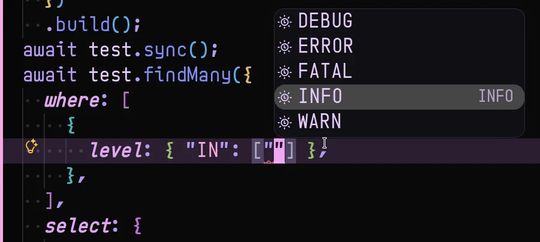
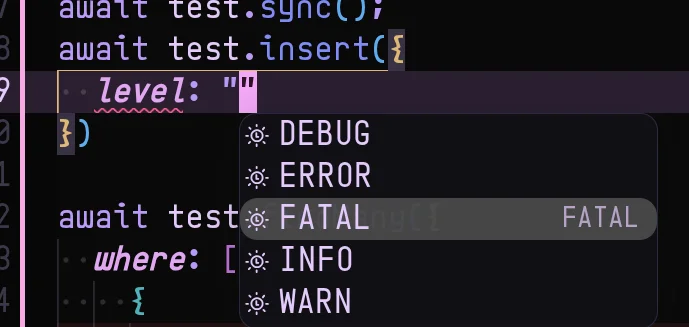

# ClickHouse ORM

 

  
|    |    |
| -- | -- |
|  |  |
| Query type supported! | Insertion and typebox type supported! |

A lightweight, type-safe ORM layer around `@clickhouse/client` for ClickHouse analytics tables.

See [packages/orm/README.md](./packages/orm/README.md) for usage.
